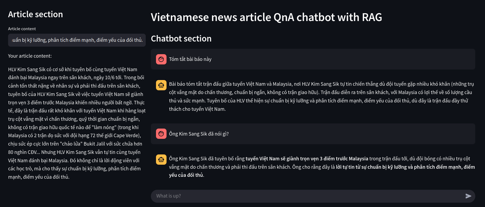

# News-QA-RAG
## 1. Introduction
This repository is my experiment on applying RAG technique on different small scale LLM *(under 2B params)* to perform **QnA task for news article**.  
    
This is to support my project **Semi-automatic Scalable Method on Contructing News Summary Dataset for Vietnamese** and serve as comparison model to those fine-tuned on our dataset.  
  
## 2.Experimentaion result
After the experimentation, I have successfully implemented `RAG` for `Qwen3-1.7b` with great result.  
  
This model shows it can answer question with **great information accuracy**. It also overcome **false assertion question** while `Gemma3-1b` assume the false assertion information is true and try to explain it. This mean, this LLM `Qwen3-1b` despite small in size but have **great accuracy and low hallucination rate** *(see News Article QnA in Notebook)*  
  
## 3. Demo
I have also created a demo with Streamlit to demonstrate how good this method is.  
  
  
  
Setup: 
```Python 3.10
git clone https://github.com/gamind65/News-QA-RAG.git
cd News-QA-RAG/
pip install --upgrade pip -q
pip3 install -r requirements.txt
curl -fsSL --no-progress-meter https://ollama.com/install.sh | sh
ollama pull nomic-embed-text
ollama pull qwen3:1.7b
streamlit run demo.py
```
  
## 4. Further improvement
With this experiment, i have successfully implemented RAG for Qwen3-1.7b and have great result.  
  
Although, my LLM does not have memory of previous question.   
  
This will be my future improvement for this project.  
  
  
---
Thats it for now.   
Peace!


